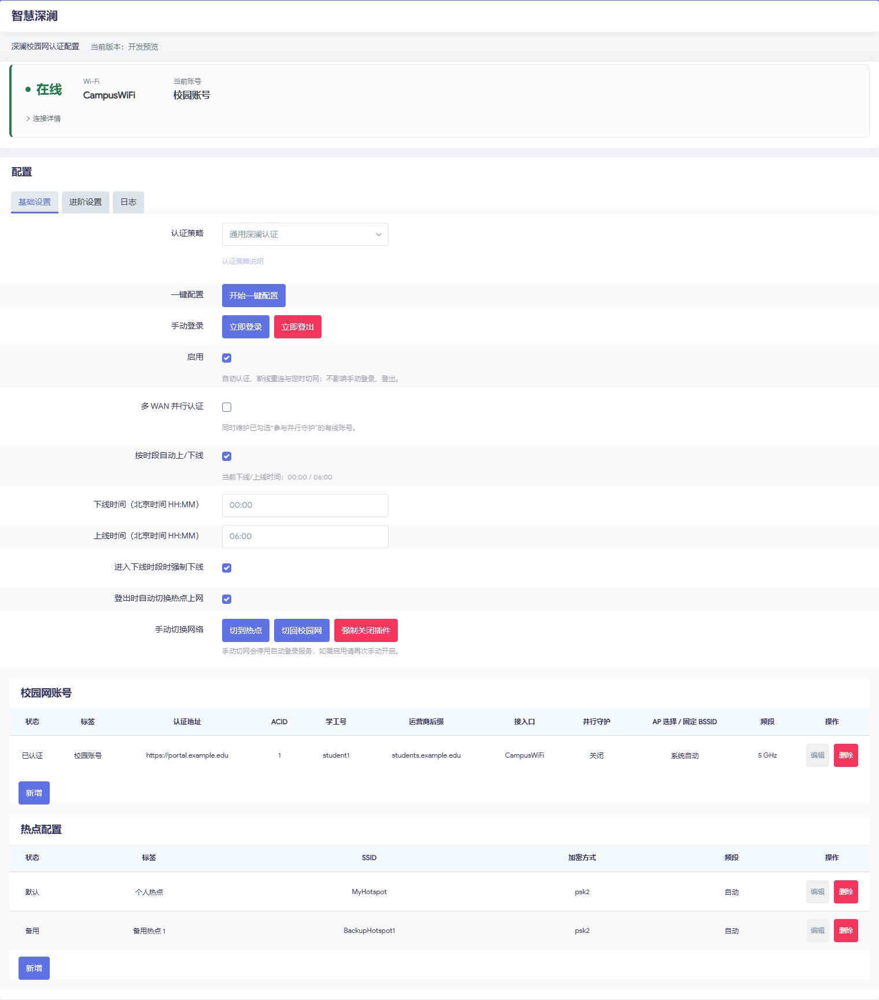

# 智慧深澜 · smart-srun

OpenWrt 深澜校园网认证插件，支持有线、无线与多账号管理。

## 使用

1. 从 [Releases](https://github.com/matthewlu070111/smart-srun/releases) 下载 `luci-app-smart-srun-bundle`：opkg 选择 `.ipk`，apk 选择 `.apk`。
2. 在 LuCI **系统 → 软件包** 更新列表并上传安装，完成后重新登录。依赖或签名问题见 [安装指南](https://smartsrun-doc.pages.dev/guide/install)。
3. 打开 **服务 → SMART SRun → 开始一键配置**，选择接入方式，确认认证地址与后缀，填写账号并保存。
4. 检查默认账号和 **启用** 状态，点击 **立即登录**。配置成功后，可通过向导提交学校预设。

[完整文档](https://smartsrun-doc.pages.dev) · [故障排查](https://smartsrun-doc.pages.dev/guide/troubleshooting) · [贡献说明与致谢](https://smartsrun-doc.pages.dev/contribute/)
